ESS 배터리 수명 예측
DAY 1 모델 전략 수립

2026-10-01 | 울산 1반 | 박민규

## ESS를 먼저 이해하기

ESS(Energy Storage System)는 전기를 저장했다가 필요한 시간에 공급하는 시스템이다. 배터리를 사용하는 ESS를 BESS라고 부른다. 태양광의 남는 전기를 저녁에 사용하고, 수요 피크 때 공급하며, 적절한 설계와 제어를 갖추면 정전 시 백업 전원을 제공할 수 있다. 배터리는 반복 충방전과 시간 경과에 따라 열화하므로 초기 상태만으로 장기간의 가용 에너지를 보장할 수 없다.

| 구성 요소 | 역할 | 수명 예측과의 연결 |
| --- | --- | --- |
| Battery: Cell → Module → Rack | 에너지 저장 | 셀의 열화가 사용 가능한 에너지와 교체 계획에 영향 |
| BMS | 전압·온도 감시, SOC/SOH 추정, 보호 | 데이터 수집과 보호 제어; 수명 모델은 보조 정보 |
| PCS | 배터리 DC와 전력망 AC의 변환 | 허용 전력·효율에 맞춰 충방전 수행 |
| EMS | 전력 수요·가격·상태에 따른 운영 계획 | 예측 수명을 고려한 사용 계획과 교체 일정 |

| 지표 | 뜻 | 주의할 구분 |
| --- | --- | --- |
| SOC (%) | 현재 충전량 / 현재 완충 용량 | 잔량: 충전하면 올라간다 |
| SOH (%) | 현재 용량 / 기준 용량 | 건강 상태: 충전만으로 회복되지 않는다 |
| SOP (W) | 현재 상태에서 허용 가능한 입출력 전력 | 에너지 용량(Ah, Wh)과 구분 |
| Cycle life / RUL | 총 수명 / 현재 시점 이후 남은 수명 | 100회 시점의 RUL은 총 수명 예측값 - 100 |

본 프로젝트의 문제: 초기 100사이클의 측정 신호로 셀의 총 cycle_life를 예측한다. 운영 관점에서는 교체 계획과 셀 선별의 근거를 만드는 연구용 모델이다. 실제 ESS 팩의 수명·화재 위험을 직접 예측하는 모델은 아니다.

도메인 기준: 이 데이터의 1.1Ah 공칭 용량에 대한 80%는 0.88Ah다. 80% EOL은 실험의 종료 기준이며, 모든 ESS 현장의 보편적인 교체 규칙은 아니다. 실제 현장에는 달력 열화, 온도, 사용 패턴, 셀 불균형과 계약 조건이 추가된다. [S1, S3]

---

## 01. 데이터 범위와 분석 신뢰도

과제가 지정한 세 파일을 각각 Batch 1·2·3으로 사용했다. 별도 2018-04-03 varcharge 파일은 이번 분석에서 제외했다. 원시 셀은 총 139개다. 본 EDA는 원본을 변경하거나 셀을 삭제하지 않고 결측·품질 플래그를 기록한다.

| 과제 배치 | 파일 날짜 | 원시 셀 | 유효 수명 라벨 | 라벨 결측 |
| --- | --- | --- | --- | --- |
| Batch 1 | 2017-05-12 | 46 | 46 | 0 |
| Batch 2 | 2018-02-20 | 47 | 39 | 8 |
| Batch 3 | 2018-04-12 | 46 | 44 | 2 |

관측 단위: summary는 셀 × 사이클, cycles는 사이클 내부 시계열이다. 모델 입력은 초기 신호를 집계한 셀당 1행이다. 수십만 개 측정값이 있어도 독립적인 학습 표본은 Batch 1의 46셀 수준이다. 배치 접두사를 포함한 b1c0 형태의 ID로 충돌을 막았다.

| 품질 점검 | 실측 결과 | 처리·해석 |
| --- | --- | --- |
| 라벨 결측 | Batch 2: 8셀 / Batch 3: 2셀 | 지도학습·성능 계산에서 제외; 관측 종료를 EOL로 임의 대체하지 않음 |
| 비정상 QD | 0 < QD < 1.5Ah 밖의 행: B1 48, B2 11, B3 0 | 그림·초기 용량 기울기에서만 고정 범위 마스킹; 원본 유지 |
| 끝 용량 >0.885Ah | B1 10셀, B2 4셀, B3 2셀 | 중도 종료·미완료 후보; 원저자 처리와 대조 후 학습 민감도 분석 |
| IR 결측·비양수 | 초기 평균 IR 계산 불가: B2 7셀 | 0을 정상 저항으로 취급하지 않고 결측으로 처리 |
| 곡선·사이클 정렬 | 모든 139셀에서 10·100회 위치 및 ΔQ 계산 가능 | summary의 cycle 값과 배열 위치 확인; Vdlin 실제 축 사용 |

라벨 결측 ID: B2 c22,c23,c35,c36,c37,c38,c39,c40 / B3 c23,c32. 수명이 짧다는 이유만으로 이상치로 삭제하지 않는다. 값이 없다는 사실과 검열(censoring)이 확정됐다는 주장은 구분한다. 분포 통계와 상관관계의 분모는 유효 라벨 수 46·39·44다. [산출 근거: cell_features.csv]

원논문 비교의 한계: 저자 LoadData.m은 두 번째 파일로 2017-06-30을 읽고, 일부 셀의 후속 기록을 연결하며, 학습·테스트 셀을 별도 인덱스로 나눈다. 과제의 B1 학습/B2 평가 구성과 일치하지 않는다. 논문 9.1%는 비교 목표로 사용하되 동일 실험 재현으로 표현하지 않는다. [S3]

---

## 02. Q1 - Cycle Life 분포

그림 1. 축 범위 150~2,300회, 동일한 150회 폭 구간(마지막 50회)으로 비교한다. 결측 라벨은 빈도에서 제외하며 유효 라벨은 모두 표시 범위 안에 있다.

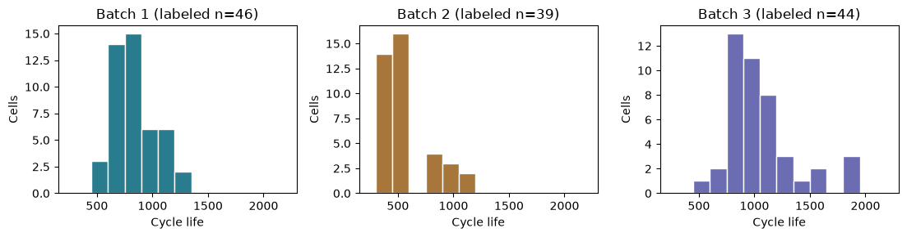

| 배치 | 최소~최대 | 중앙값 / 평균 | IQR | <500회 | >1,000회 |
| --- | --- | --- | --- | --- | --- |
| B1 (n=46) | 534~1227 | 858.5 / 844.7 | 703.2~914.2 | 0/46 (0.0%) | 10/46 (21.7%) |
| B2 (n=39) | 392~1186 | 472.0 / 565.7 | 439.5~508.5 | 28/39 (71.8%) | 3/39 (7.7%) |
| B3 (n=44) | 541~1935 | 1005.5 / 1059.7 | 828.0~1155.2 | 0/44 (0.0%) | 23/44 (52.3%) |

핵심 발견: Batch 2의 중앙값 472회는 Batch 1의 858.5회보다 386.5회 낮다. Batch 3는 장수명(>1,000회)이 23/44셀, 52.3%다. 같은 실험 계열이라도 타깃 분포가 크게 다르다. B1·B2 분포가 유사하다는 과제 설명은 분석에 사용한 원본의 관측값과 맞지 않는다.

단수명 사례: b2c19=392회(6C(60%)-3C), b2c6=393회(3.6C(9%)-5C), b2c15=396회(동일 정책). 낮은 1단계 C-rate에도 단수명 셀이 있으므로 정책 전체와 열화 신호를 함께 봐야 한다. 실험 조건·기록 품질을 확인하기 전에는 원인을 확정하지 않는다.

분류를 선택하지 않는 이유: 550회 기준 단수명 셀은 B1 1/46, B2 30/39, B3 1/44이다. B1에서 모두 장수명이라 예측해도 정확도는 97.8%다. 소수 클래스 1개로 안정적인 분류 학습·검증이 어렵다. 회귀는 연속 수명 정보를 보존하고 분류 임계값 의존성을 줄인다.

모델 전략: 회귀 타깃 cycle_life를 선택한다. 작은 표본에 적합한 규제 모델을 우선 검토하고, 외부 배치에서 수명 범위 밖으로의 예측 위험을 평가한다. B2의 짧은 수명을 놓치는 과대 예측은 교체 계획을 늦출 수 있으므로 잔차 부호도 보고한다.

---

## 02b. 단수명 셀의 초기 신호 비교

<500회 셀은 B2에만 있으므로 배치 차이와 셀 차이를 혼동하지 않도록 B2 안에서 비교한다. 비교군은 수명 ≥500회인 나머지 유효 라벨 셀이다. 평균 차이는 인과관계나 예측 성능을 의미하지 않는다.

| 지표 | <500회: 중앙값 [Q1, Q3]; n | ≥500회: 중앙값 [Q1, Q3]; n |
| --- | --- | --- |
| 수명 (회) | 449.500 [424.750, 474.000]; n=28 | 841.000 [784.000, 1013.000]; n=11 |
| ΔQ 로그 분산 (log10 Ah²) | -3.446 [-3.495, -3.277]; n=28 | -4.232 [-4.308, -4.117]; n=11 |
| 초기 평균 온도 (°C) | 32.938 [32.075, 33.427]; n=28 | 33.608 [32.549, 33.989]; n=11 |
| 초기 충전시간 (분) | 10.175 [10.174, 10.219]; n=28 | 10.040 [10.040, 53.150]; n=11 |
| 1단계 충전율 (C) | 5.200 [4.650, 5.600]; n=28 | 5.200 [4.800, 5.400]; n=11 |
| 10회 양의 전류 샘플 평균 (A) | 2.023 [1.910, 2.136]; n=28 | 2.451 [2.443, 2.556]; n=11 |

관측 결과: 단수명 28셀과 비교군 11셀의 ΔQ 로그 분산 중앙값은 각각 -3.446, -4.232이다. 1단계 충전율 중앙값은 두 그룹 모두 5.2C이고, 단수명 그룹의 초기 평균 온도도 더 낮다. 따라서 높은 1단계 충전율이나 높은 온도만으로 단수명을 설명할 근거는 부족하다. ΔQ 로그 분산은 값이 클수록 변화의 분산이 크며, 배치별 수명 상관도 음수로 일관되어 핵심 후보로 둔다. 온도·전류·충전시간은 정책과 측정 조건이 함께 달라지므로 단독 원인으로 판단하지 않는다.

추가 확인 계획: 정책별 표본 수와 조건이 유사한 셀을 비교하고, 초기 온도·전류의 기록 품질을 점검한다. 현재 비교에는 수명 라벨을 사용했으므로 그룹 자체를 입력 피처로 쓰지 않는다. 모델 채택과 튜닝은 B1 내부 검증으로만 결정한다.

## 배치별 최단 수명 셀과 이상치 판정

| 최단 셀 | 수명 / 회 | 정책 | IQR 하한 | 하한 미만 n |
| --- | --- | --- | --- | --- |
| B1: b1c20 | 534 | 5.4C(80%)-5.4C | 386.8 | 0 |
| B2: b2c19 | 392 | 6C(60%)-3C | 336.0 | 0 |
| B3: b3c28 | 541 | 3.7C(31%)-5.9C-newstructure | 337.1 | 0 |

최단 셀은 상대적 하위 사례이며 세 배치 모두 IQR 하한 미만 셀은 없다. <500회 분류와 통계적 이상치를 구분한다. B1·B3에는 <500회 셀이 없다. B2 단수명은 ΔQ 변화와 동반되지만 낮은 온도·같은 충전율에서도 나타나므로 짧은 이유는 정책 전체·셀 차이·기록 품질의 가설로 남긴다. 수명이 짧다는 이유로 삭제하지 않는다.

---

## 03. Q2 - 열화 곡선과 Knee 후보

그림 2. 전 셀의 QD 곡선. 점선은 0.88Ah이며 수명 라벨 결측은 회색으로 표시한다.

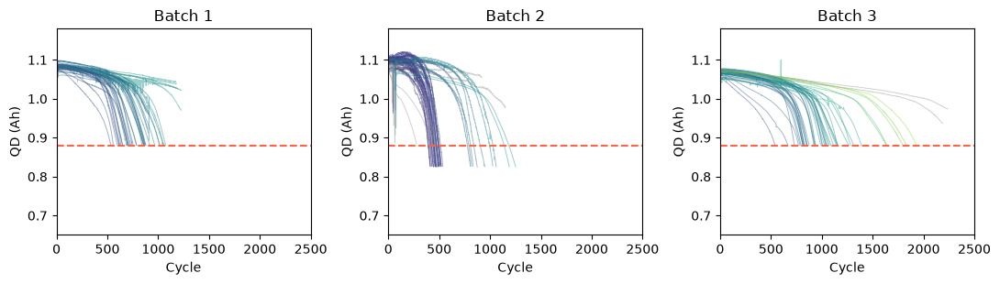

그림 3. 고정 예시 b1c0·b2c0·b3c0의 연속 구간 모델 후보. b1c0는 SSE 감소 19.6%로 20% 기준 미충족이며, b2c0·b3c0는 탐색적 지지 기준을 충족한다. Supported는 물리적 knee 확정을 뜻하지 않는다.

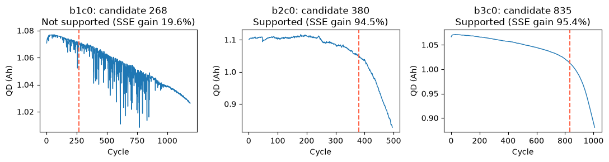

핵심 발견: 초기 용량은 유사하지만 후반 감소 속도는 달라진다. 급격한 하강은 단일 기울기보다 구간별 기울기로 설명하기 적합하다. 다음 페이지에서 단일 직선 대비 잔차 개선과 후보 위치의 안정성을 수치로 검증한다.

모델 전략: 10~100회 QD 기울기와 QD100-QD10은 초기 변화 피처다. 전체 수명에서 얻은 knee·후반 기울기·최종 용량·관측 길이는 EDA 설명용이며 모델 입력에 넣지 않는다. QD100-QD10은 실제 해당 사이클 값으로 구현했다.

---

## 03b. Knee 후보의 근거와 안정성

방법: 0<QD<1.5Ah, 10회 이후 관측에 21회 이동 중앙값을 적용한다. c+a·cycle+b·max(0, cycle-k)의 연속 구간 모델에서 양쪽 최소 30개 관측을 갖는 60개 k 후보를 탐색한다. 같은 데이터의 단일 직선과 잔차 제곱합(SSE)을 비교한다.

| 배치 / 적합 n | SSE 감소 중앙값 | ΔBIC 중앙값 | 후보 중앙값 / 회 | 평활 변경 위치 폭 / 회 |
| --- | --- | --- | --- | --- |
| B1 / 46 | 96.9% | 2663 | 599 | 0 |
| B2 / 45 | 93.6% | 1327 | 353 | 6 |
| B3 / 46 | 95.5% | 3185 | 827 | 0 |

SSE 감소=1-SSE_구간/SSE_직선. ΔBIC=BIC_직선-BIC_구간이며 양수는 구간 모델을 지지한다. 직선 2개·구간 모델 4개(k 탐색 포함) 파라미터를 반영한다. 평활 변경 위치 폭은 11·21·31회 평활의 최대 k-최소 k로 계산했다.

| 배치 | 전반 기울기 중앙값 | 후반 기울기 중앙값 | 전체 / 적합 / 지지 n |
| --- | --- | --- | --- |
| B1 | -6.96e-05 | -7.05e-04 | 46 / 46 / 45 |
| B2 | -1.32e-04 | -1.52e-03 | 47 / 45 / 44 |
| B3 | -6.02e-05 | -6.79e-04 | 46 / 46 / 46 |

탐색적 지지 기준을 명시했다: SSE 감소≥20%, ΔBIC>10, 후반 기울기<전반 기울기<0, 평활 변경 위치 폭≤관측 사이클 범위의 5%. 이 기준은 라벨·모델 성능을 최적화한 결과가 아닌 분석 규칙이다. 모든 강제 분할점을 knee로 인정하지 않는다.

해석: 세 배치 모두 후반 기울기가 더 음수이며 단일 직선보다 오차가 감소한다. 평활 폭을 바꿨을 때 후보 위치 폭 중앙값은 0·6·0회다. 원시 139셀 중 적합 가능한 137셀의 설명용 결과다. B2의 2셀은 유효 용량 관측 부족으로 적합되지 않아 중앙값 계산에서 제외했다. 적합 셀 중 기준 충족은 B1 45/46, B2 44/45, B3 46/46이며, 수명 결측·끝 용량 품질 후보도 포함된다.

한계: 평활된 연속 측정값은 독립 오차가 아니므로 ΔBIC를 엄밀한 유의성 검정으로 해석하지 않는다. 전체 수명 내 후보 탐색, 평활 선택, 최소 구간 길이에 의존한다. 화학적 전이점 확인에는 별도 물리 검증이 필요하며 이 결과는 모델 입력으로 사용하지 않는다.

---

## 04. Q3 - 초기 ΔQ(V)와 수명 신호

정의: ΔQ(V) = Qdlin(100번째 사이클, V) - Qdlin(10번째 사이클, V). 0부터 시작하는 배열에서는 99번과 9번이다. 추정 전압 축 대신 파일의 Vdlin을 사용했다. 실제 범위는 2.0~3.5V, 1,000포인트로 과제의 3.6V 설명과 차이가 있다.

그림 4. >1,000회와 <500회 셀의 ΔQ 곡선 및 중앙값. B1·B3에는 <500회 라벨 셀이 없으므로 단수명 그룹 비교를 꾸며 넣지 않았다.

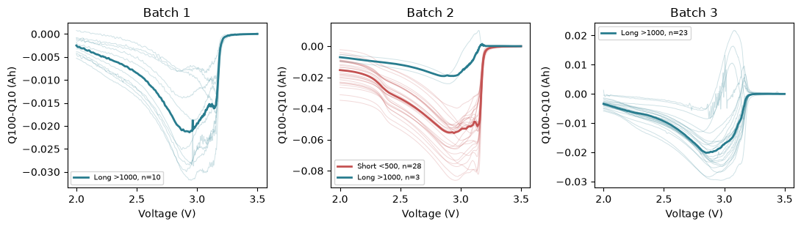

그림 5. log10 Var(ΔQ)와 수명. 모든 곡선은 실제 전압 축 정렬을 확인했다.

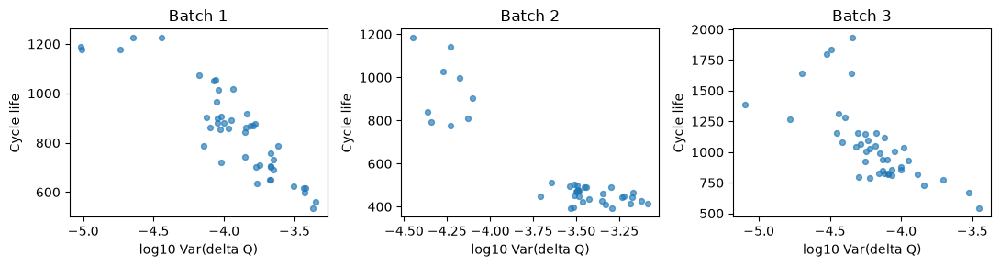

| 배치 | 유효 라벨 n | Pearson r | Spearman ρ |
| --- | --- | --- | --- |
| B1 | 46 | -0.886 | -0.871 |
| B2 | 39 | -0.902 | -0.709 |
| B3 | 44 | -0.702 | -0.797 |

핵심 발견: ΔQ 분산의 로그는 세 배치에서 모두 수명과 강한 음의 관계다. B1 r=-0.886이며 단순 초기 평균 QD와의 상관 r=0.215보다 크다. 로그 분산이 커질수록 짧은 수명과 연결되는 경향이 관측됐다. 상관관계는 예측 성능과 동일하지 않다.

모델 전략: log10(max(Var(ΔQ), 1e-12))를 주 피처로 삼고 ΔQ 최소값·평균값은 대체 또는 추가 후보로 검토한다. 고차원 1,000점 전체 입력은 46셀에서 과적합 위험이 커 요약 통계부터 시작한다. B1·B3의 장단 비교 부족은 다음 페이지의 배치 내 사분위 비교로 보완한다.

---

## 04b. 배치 내 상대 수명 비교와 전압 민감도

그림 5b. 배치 내 하위(Q1 이하)·상위(Q3 이상) 수명 그룹. 선은 ΔQ 중앙값, 음영은 IQR이다. 절대 <500/>1,000회 정의와 구분한다.

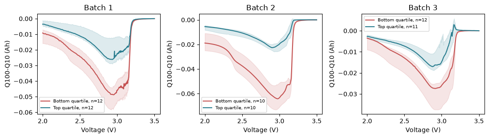

| 배치 / 그룹 | n | 수명 경계 / 회 | 수명 중앙값 | log Var(ΔQ) 중앙값 |
| --- | --- | --- | --- | --- |
| B1 / 하위 | 12 | 703.25 | 630.5 | -3.577 |
| B1 / 상위 | 12 | 914.25 | 1064.0 | -4.125 |
| B2 / 하위 | 10 | 439.50 | 414.0 | -3.340 |
| B2 / 상위 | 10 | 508.50 | 872.5 | -4.232 |
| B3 / 하위 | 12 | 828.00 | 804.5 | -4.079 |
| B3 / 상위 | 11 | 1155.25 | 1390.0 | -4.455 |

핵심 발견: 세 배치 모두 상대적 하위 수명 그룹의 ΔQ 로그 분산 중앙값이 상위 그룹보다 크다. 절대 단수명 셀이 없는 B1·B3에서도 방향을 확인했다. 경계값의 동률 때문에 B3 하위 그룹은 12셀이다. B2 절대 장수명 그룹은 3셀뿐이므로 상대 그룹 비교를 보완 근거로 사용한다.

| 배치 | 3.5V ΔQ 오프셋 최대 / Ah | 전체↔2.1~3.2V 피처 순위 ρ |
| --- | --- | --- |
| B1 | 3.98e-04 | 0.983 |
| B2 | 1.09e-03 | 0.883 |
| B3 | 1.97e-04 | 0.904 |

기준점 점검: 각 셀 ΔQ에서 3.5V 값을 빼고 다시 계산한 로그 분산 차이는 최대 8.9e-16으로 수치 오차 수준이다. 상수 오프셋에는 분산이 불변이지만 최소·평균은 바뀔 수 있다. 따라서 주 피처는 분산이며 최소·평균은 보조 후보로만 유지한다.

전체 2.0~3.5V와 공통 내부 구간 2.1~3.2V의 피처 순위 상관은 표와 같다. 내부 구간은 끝점 영향에 대한 고정 민감도 점검이며 성능 최적화로 고른 범위가 아니다. 이는 전압 축·상수 오프셋 점검으로, newstructure의 측정 절차·용량 기준 차이가 해결됐다는 뜻은 아니다.

---

## 04c. ΔQ 통계 피처의 추출과 선택

| 피처 | 계산식 / 의미 | 모델 전략 |
| --- | --- | --- |
| dq_logvar | log10(max(Var(ΔQ), 1e-12)); 1,000점 분산의 로그 | A의 핵심 피처 |
| dq_min | min(ΔQ); 가장 작은 전압별 변화 | 분산의 대체 후보 |
| dq_mean | mean(ΔQ); 전체 전압 구간 평균 변화 | 분산의 대체 후보 |
| QD100_minus_QD10 | summary의 100회 용량 - 10회 용량 | B 확장 후보; ΔQ 곡선 평균과 구분 |

| 배치 | ΔQ 통계 | 유효 라벨 n | 수명 Pearson r | Spearman ρ |
| --- | --- | --- | --- | --- |
| B1 | dq_logvar | 46 | -0.886 | -0.871 |
| B1 | dq_min | 46 | 0.882 | 0.850 |
| B1 | dq_mean | 46 | 0.854 | 0.828 |
| B2 | dq_logvar | 39 | -0.902 | -0.709 |
| B2 | dq_min | 39 | 0.819 | 0.661 |
| B2 | dq_mean | 39 | 0.767 | 0.697 |
| B3 | dq_logvar | 44 | -0.702 | -0.797 |
| B3 | dq_min | 44 | 0.692 | 0.776 |
| B3 | dq_mean | 44 | 0.639 | 0.756 |

ΔQ 로그 분산은 모든 배치에서 수명과 음의 관계이며 최소값·평균은 양의 관계다. 곡선 차이를 저차원 통계로 요약해 46셀의 작은 학습 표본에서 입력 차원을 제한한다. 세 통계는 같은 곡선에서 추출해 중복 가능성이 있어 모두 자동 채택하지 않는다. 후보 간 예측 성능의 우열은 B1 내부 검증에서 결정하며 상관계수만으로 확정하지 않는다.

분산은 1,000개 전압 지점의 기술적 분산(ddof=0)이며 셀 간 분산과 구분한다. 장·단수명 비교는 앞 페이지의 절대 기준 및 배치 내 사분위 곡선으로 확인한다. 수명 결측 셀은 수명 상관에서 제외한다.

---

## 05. Q4 - 충전 정책별 수명 비교

그림 6. 각 배치 평균 수명 하위·상위 3개 정책. 이름 옆 n은 유효 라벨 수, 오차 막대는 ±1 표준편차다. *는 -newstructure suffix를 뜻한다.

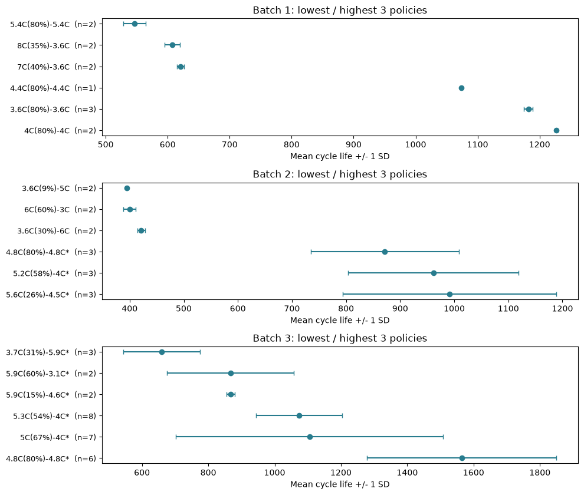

수명 결측만 있는 정책은 평균 비교에서 제외했다. 정책 전체 목록은 policy_stats.csv로 제공하고, PDF에는 양 극단을 명시적으로 선정했다. n=1의 막대 길이 0은 분산이 없다는 의미가 아니라 표준편차를 계산할 수 없다는 뜻이다.

B1 4C(80%)-4C의 평균은 1226.5회(n=2), 5.4C(80%)-5.4C는 546.5회(n=2)다. 전자의 두 셀은 끝 용량 품질 후보이므로 완료 수명·정책 효과를 단정하지 않는다. B3 4.8C(80%)-4.8C-newstructure는 1564.2회(n=6), 3.7C(31%)-5.9C-newstructure는 660회(n=3)다.

---

## 05b. 충전 조건 → 피처·그룹 검증

그림 7. 첫 단계 C-rate와 수명. 색은 초기 온도이며 각 패널의 색 범위가 달라 색 자체의 배치 비교는 피한다.

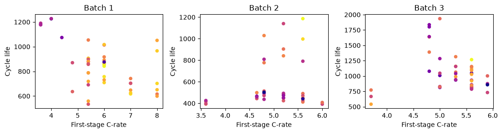

| 관계: Pearson r | B1 | B2 | B3 |
| --- | --- | --- | --- |
| 1단계 C-rate ↔ 수명 | -0.580 | 0.191 | -0.083 |
| 양의 전류 샘플 평균 ↔ 수명 | -0.525 | 0.758 | -0.329 |
| 초기 QD 기울기 ↔ 수명 | 0.524 | -0.484 | 0.361 |

핵심 발견: 첫 단계 C-rate의 수명 상관은 B1 -0.580, B2 +0.191, B3 -0.083이다. 초기 전류 평균과 QD 기울기의 상관은 B1 -0.134(n=46), B2 -0.808(n=47), B3 +0.163(n=46)이다. 충전이 빠르면 항상 단수명이라는 주장을 지지하지 않는다.

10회 사이클의 I>0 샘플 평균·최대값을 탐색했으며 시간 가중 평균은 아니다. 전환 SOC, 후반 충전 속도, 구조 suffix와 혼재돼 인과효과는 분리되지 않았다. 평균±표준편차는 정책별 관측 분포이지 신뢰구간이 아니다.

모델 전략: C1·전환%·C2는 보조 피처 세트 C로만 비교한다. VarCharge는 2단계 정책 형식으로 임의 변환하지 않고 결측 처리한다. 동일 정책 문자열을 그룹으로 유지하여 B1 내부 검증을 분리한다. 정책 조건 의존성이 크므로 주 피처 ΔQ 신호보다 우선하지 않는다.

---

## 05c. 실제 충전 전류 패턴과 초기 열화

그림 7b. 배치별 사전 고정 예시 c0·c14의 10회 사이클 I(t). 양수는 충전, 음수는 방전이다. 점선은 정책의 명목 전류(C-rate×1.1Ah)로, 실제 전환 시점 또는 SOC 측정값을 뜻하지 않는다.

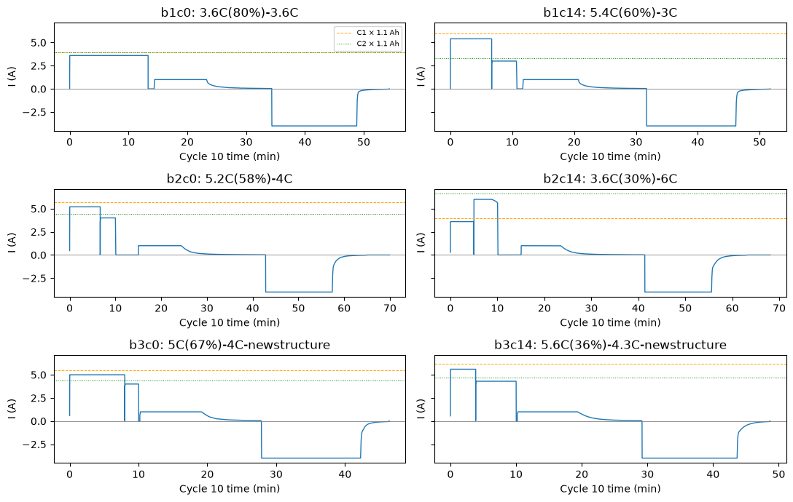

| 셀 | 수명 / 회 | 초기 QD 기울기 / Ah·회⁻¹ | ΔQ 로그 분산 |
| --- | --- | --- | --- |
| b1c0 | 1190 | 3.09e-06 | -5.015 |
| b1c14 | 880 | 1.63e-05 | -4.046 |
| b2c0 | 477 | 1.01e-05 | -3.487 |
| b2c14 | 426 | -1.00e-04 | -3.119 |
| b3c0 | 1009 | -1.52e-05 | -4.245 |
| b3c14 | 858 | -7.18e-06 | -4.000 |

관측: 양의 전류 유지 구간·단계 전환·후반 전류 감소가 정책에 따라 다르고, 이후 방전 구간이 나타난다. 초기 QD 기울기와 ΔQ 로그 분산을 동일 셀에 연결했지만 예시 6셀만으로 정책의 인과효과를 추정하지 않는다. 전체 셀 전류 요약과 QD 기울기의 상관은 앞 페이지에서 제시했다.

전략: c0·c14는 수명 라벨을 기준으로 선별하지 않았다. 전류 샘플 평균은 측정 간격의 영향을 받으므로 시간 가중 적분과 구간별 체류시간은 후속 후보로 둔다. 현재는 초기 ΔQ와 용량 기울기를 우선하고 정책 피처는 보조 세트 C에서만 비교한다.

---

## 05d. 충전시간 기록 품질과 피처 선택

그림 7c. 모든 셀의 초기 10~100회 summary.chargetime. 로그 축으로 극단 기록을 포함해 표시한다. 30분 경계는 기술적 집계용이며 삭제 기준이 아니다.

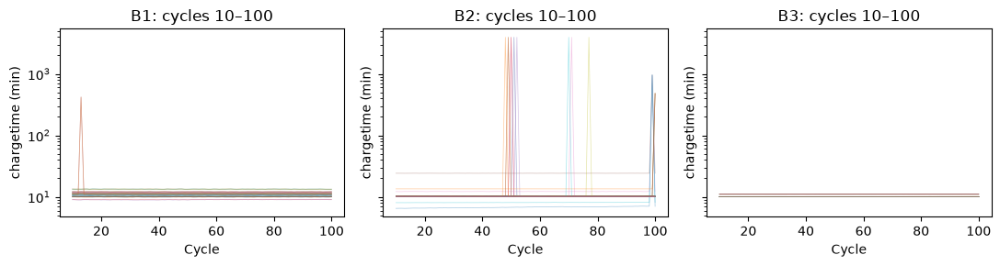

| 배치 | 초기 기록 n | >30분 기록 n / 셀 n | 최대 / 분 |
| --- | --- | --- | --- |
| B1 | 4186 | 3 / 3 | 419.87 |
| B2 | 4277 | 19 / 18 | 3934.71 |
| B3 | 4186 | 0 / 0 | 11.07 |

| 확인 예시 | 초기 평균 / 분 | 초기 중앙값 / 분 | 초기 최대 / 분 |
| --- | --- | --- | --- |
| b2c14 | 53.367 | 10.245 | 3934.705 |
| b2c32 | 53.155 | 10.041 | 3933.455 |

확인: b2c14의 50회, b2c32의 71회에 약 3,934분 기록이 각각 한 건 존재하여 초기 평균을 약 53분으로 끌어올린다. 정상 충전, 휴지 시간 포함, 중단 또는 기록 문제 중 어느 원인인지는 필드 정의와 실험 로그 대조 없이는 확정할 수 없다. 단일 10회 전류 곡선으로 다른 사이클의 극단값을 설명하지 않는다. 원본과 평균을 보존한다.

처리 전략: B의 충전시간 피처는 10~100회 중앙값으로 변경한다. B1 동일 CV에서 중앙값 / 평균 / 충전시간 제외의 세 조건을 비교하고 같은 1-SE 규칙으로 선택한다. 외부 배치에서 확인한 품질 관찰임을 명시하며 B2 성능으로 처리 규칙을 튜닝하지 않는다. 30분 초과 기록을 자동 삭제하거나 평균을 정상 충전시간으로 해석하지 않는다.

---

## 05e. 전류 패턴 요약과 초기 용량 변화율

그림 7d. 10회 양의 전류 샘플 평균과 10~100회 QD 선형 기울기. y축은 10^-5 Ah/회 단위다. 초기 변화의 대리 지표이며 전 수명 평균 열화율과 구분한다.

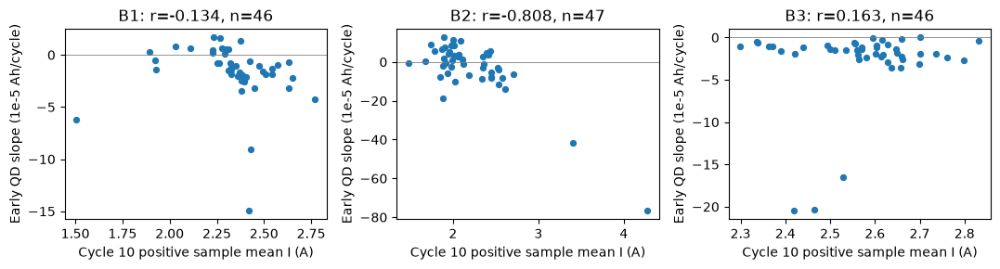

| 배치 | 전류·기울기 유효 n | Pearson r | Spearman ρ |
| --- | --- | --- | --- |
| B1 | 46 | -0.134 | -0.552 |
| B2 | 47 | -0.808 | -0.477 |
| B3 | 46 | 0.163 | -0.177 |

해석: B2는 전류 요약이 클수록 초기 QD 기울기가 작아지는 관계가 강하지만 B1은 약한 음의 관계, B3는 약한 양의 관계다. 음의 기울기는 용량 감소, 양의 기울기는 해당 초기 구간의 용량 증가를 뜻하므로 모두를 양의 열화 속도로 해석하지 않는다. 초기 용량의 활성화·측정 조건·충전 정책이 섞여 있으며 상관 부호가 배치별로 달라 전류 증가가 열화를 유발한다고 단정하지 않는다.

수명 라벨이 없어도 두 초기 피처가 있으면 이 상관 계산에 포함한다. 따라서 n=46·47·46이며, 수명 상관의 n=46·39·44와 다르다. 단계별 시간 가중 전류는 추가 검토 후보이고, 현재 모델은 ΔQ·초기 용량 기울기를 우선 사용한다.

---

## 06. Q5 - 상관관계와 다중공선성

그림 8. 배치별 Pearson 상관행렬. 초기 피처는 10~100회 집계. 결측은 변수 쌍별로 제외되므로 실제 n은 correlations.csv에서 확인한다.

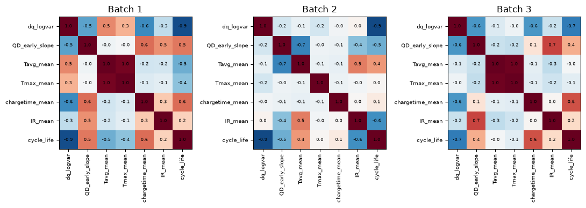

| 수명과 Pearson r | B1 (n=46) | B2 (기본 n=39) | B3 (n=44) |
| --- | --- | --- | --- |
| log10 Var(ΔQ) | -0.886 | -0.902 | -0.702 |
| 초기 평균 QD | 0.215 | -0.337 | 0.222 |
| QD100 - QD10 | 0.550 | -0.187 | 0.330 |
| 평균 IR | 0.231 | -0.617 | 0.188 |
| 평균 온도 | -0.486 | 0.431 | -0.021 |
| 충전시간 평균 | 0.556 | 0.087 | 0.637 |

핵심 발견: ΔQ 로그 분산의 방향은 배치 간 일관되지만 온도·IR·충전시간 관계는 크기나 부호가 바뀐다. 예를 들어 Tavg는 B1 -0.486, B2 +0.431, B3 -0.021이다. QD100-QD10도 B1 +0.550, B2 -0.187, B3 +0.330으로 방향이 달라 핵심 피처로 확정하지 않는다. B 확장 후보로 두고 B1 내부 검증에서 개선 여부를 확인한다. 통합 상관계수 하나로 전체 물리를 설명하면 배치 효과와 셀 관계를 혼동할 수 있다. B2 IR의 유효 표본은 33셀이다.

다중공선성: Tavg와 Tmax 상관은 B1 0.956, B3 0.971이다(B2 -0.065). 두 온도를 모두 넣을 때 선형 계수가 불안정해질 수 있다. 초기안에서는 Tavg를 대표로 두고 Tmax 추가는 B1 내부 검증으로 결정한다. ΔQ 최소값·평균·분산도 같은 곡선에서 나왔으므로 모두 자동 채택하지 않는다.

모델 전략: 단일 주 피처 → 용량 기울기·온도 추가 → 정책 보조 피처의 순서로 비교한다. 작은 표본에서는 다중공선성·피처 수를 제어하는 Ridge/ElasticNet을 우선 후보로 둔다. 표준화·결측 대체·피처 선택은 각 학습 폴드에서만 학습한다.

중요한 평가 한계: 과제가 세 배치의 EDA를 요구해 B2·B3의 라벨 분포와 관계도 이미 관찰했다. 따라서 B2를 완전히 보지 않은 blind test라고 주장할 수 없다. 이후 선택·튜닝은 B1 안에서만 하고, 추가 독립 데이터로 최종 일반화를 확인해야 한다.

---

## 06b. 가장 강한 수명 관계와 중복 피처

| 배치 | 순위 | 초기 피처 | 유효 라벨 n | Pearson r |
| --- | --- | --- | --- | --- |
| B1 | 1 | dq_logvar | 46 | -0.886 |
| B1 | 2 | dq_min | 46 | 0.882 |
| B1 | 3 | dq_mean | 46 | 0.854 |
| B2 | 1 | chargetime_median | 39 | -0.916 |
| B2 | 2 | dq_logvar | 39 | -0.902 |
| B2 | 3 | dq_min | 39 | 0.819 |
| B3 | 1 | dq_logvar | 44 | -0.702 |
| B3 | 2 | dq_min | 44 | 0.692 |
| B3 | 3 | dq_mean | 44 | 0.639 |

순위는 추출한 초기 피처 중 |Pearson r| 기준이다. 중심화·내부 전압 구간 분산은 민감도 변형이므로 별도 후보 순위에서 제외했다. B1·B3는 ΔQ 로그 분산이 가장 강하고, B2는 충전시간 중앙값이 가장 강하다. 충전시간은 B1·B3와 B2에서 부호가 달라 배치 간 일관된 핵심 신호는 ΔQ 로그 분산으로 판단한다. 최강 단변량 상관과 최적 예측 피처를 동일시하지 않는다.

| 피처 쌍 | B1 r | B2 r | B3 r |
| --- | --- | --- | --- |
| Tavg_mean ↔ Tmax_mean | 0.956 | -0.065 | 0.971 |
| QD_early_slope ↔ QD100_minus_QD10 | 0.977 | 0.967 | 0.992 |
| dq_logvar ↔ dq_min | -0.947 | -0.930 | -0.926 |
| dq_logvar ↔ dq_mean | -0.926 | -0.897 | -0.900 |

피처 쌍의 결측은 쌍별 제외하며 수명 라벨 결측 여부와 무관하게 계산했다. 온도는 Tavg를 대표로 두고, 용량 기울기와 QD100-QD10도 중복이 강하므로 추가 피처는 기존 기울기의 대체 조건도 함께 검토한다. ΔQ 최소·평균은 주 피처의 대체 후보로 두고 Ridge로 계수 불안정을 완화한다.

---

## 07. EDA → 피처 → 후보 모델

| EDA 근거 | 초기 피처 설계 | 선택 이유 / 주의 |
| --- | --- | --- |
| ΔQ logvar r=-0.886 (B1) | 주 피처: dq_logvar | 연속 타깃과 일관된 신호; 첫 기준 모델은 단일 피처 |
| 초기 QD 평균 관계 약함 | QD_early_slope, QD100-QD10 | 수준보다 변화; 100회 이내만 사용 |
| B1 온도 관계 / 중복 | Tavg_mean; Tmax는 보류 | Tavg/Tmax 중복 완화; 배치 의존성 점검 |
| B1 충전시간 관계 | chargetime_median | 극단 기록의 영향 완화; 평균/제외를 B1 CV에서 비교 |
| 정책 효과가 배치별 상이 | C1, switch_pct, C2 | 정책은 보조 후보; ID·batch 번호는 입력 제외 |
| IR 부호 변화·결측 | IR_mean은 탐색 후보 | 0값 결측 처리; 포함/제외 검증 비교 |

Feature 세트: A = dq_logvar 단독. B = A + QD_early_slope + Tavg_mean + chargetime_median. C = B + C1 + switch_pct + C2. ΔQ 최소·평균과 IR은 제한된 대체 후보로 비교한다. QD100-QD10은 1차 A/B/C 비교 이후 B에 추가 또는 QD 기울기를 대체한 Ridge로 비교하며 동일 CV·alpha·타깃 표현·1-SE 규칙을 적용한다.

| 후보 모델 | EDA와의 연결 | Day2 비교 방식 |
| --- | --- | --- |
| 중앙값 Dummy | 46셀의 작은 표본; 학습 필요성 확인 | B1 학습 수명의 중앙값만 예측 |
| 선형 회귀 (원/로그 수명) | ΔQ 로그 분산의 강한 관계 | A 단독; 원 단위로 역변환해 MAPE |
| Ridge / ElasticNet | 온도 중복, 제한 표본, 다중 피처 | 우선 Ridge B·C; ElasticNet은 후속 후보 |
| SVR (RBF) | 선형 모델 잔차에 곡률이 남을 가능성 | 선형 모델 잔차 곡률 확인 후에만 추가 |
| 얕은 Random Forest | 상호작용·비선형성 후보 | 잔차 상호작용 확인 후 추가; 외삽 취약 |

초기 우선순위는 단일 피처 선형 모델과 규제 회귀다. 비선형성은 아직 확인되지 않은 가설이므로 SVR·RF는 검증 후보로만 둔다. 1차 비교는 Dummy, A 선형 회귀, B·C Ridge로 제한한다. 선택 규칙은 다음 페이지에 고정한다. 딥러닝은 독립 셀 46개에서 고차원 과적합 부담이 커 본 연구의 우선 후보에 두지 않는다.

최종 모델은 미선정이다. EDA의 상관계수로 최종 예측 성능을 주장하거나 모델을 확정하지 않는다. Day2 내부 검증 결과로 선택한다.

---

## 08. Warm up 원칙을 반영한 검증 계획

Wrap-up의 재현성·누수 방지·정직한 평가 원칙을 적용한다. Day1은 탐색과 전략을 완료하는 단계이며 아직 모델을 학습하지 않았다. 아래 표는 Day2에서 산출할 평가 지표와 비교 기준을 정의한 계획이다. [S2]

| 단계 | 계획 |
| --- | --- |
| 1. B1 Hold-out 분리 | 46셀의 충전 정책 그룹을 GroupShuffleSplit(test_size=0.2, random_state=42)로 train/valid 분리. 정책 수 기준 20%이므로 실제 셀 비율은 달라질 수 있음. |
| 2. Train (B1 CV) | Hold-out을 제외한 B1 개발 셀에서 GroupKFold(5). 동일 정책이 fold 양쪽에 들어가지 않도록 그룹 지정. CV 평균±표준편차 보고. |
| 3. 전처리·타깃 | fold train에서만 median imputer·scaler fit. X는 100회 이내 피처. y=cycle_life 또는 log10(cycle_life); MAPE는 원 사이클 단위. |
| 4. 피처·모델 선택 | 1차 Dummy + A 선형 + B/C Ridge(alpha=0.1,1,10). 추가 B+QD100-QD10 및 기울기 대체 Ridge, B의 충전시간 평균/제외 조건. 원/로그 타깃을 동일 fold·1-SE 규칙으로 비교; hold-out은 1회 확인. |
| 5. 최종 평가 | 선택을 고정한 뒤 전체 B1로 재학습, 유효 라벨 B2 39셀을 한 번 평가. B3 44셀 추가 평가. EDA에서 외부 라벨을 봤다는 한계 표기. |
| 6. 품질 민감도 | 끝 QD>0.885Ah는 확인 후보이며 자동 삭제 금지. B1 원본 46셀 유지가 주 분석. 학습 fold 내 후보 제외는 같은 검증 셀에서 보조 민감도로만 비교. |

Hold-out만으로 정책 분리가 자동 보장되지는 않는다. 반드시 group 지정이 필요하다. 같은 셀의 사이클 행 무작위 분할은 금지한다. 초기 100회 내 정보를 가진 새로운 셀의 수명 예측이므로 셀·정책 분리와 미래 정보 차단을 함께 적용한다. CV 수치는 fold 안의 검증 성능이다. 그룹 fold의 오차가 독립적이지 않으므로 표준오차는 선택용 근사이며 엄밀한 신뢰구간으로 쓰지 않는다.

선택 규칙: 평균 CV MAPE 최저 후보의 SE=fold 표준편차/√5를 계산한다. 최저 평균+SE 이내 후보 중 피처 수가 적고 모델이 단순한 것을 선택한다. 동률이면 원 수명 표현, 그 다음 더 강한 Ridge 규제를 우선한다. 로그 타깃은 역변환 후 원 단위로 평가한다.

| 구분 | MAPE (%) | 비고 |
| --- | --- | --- |
| Train (Batch 1 CV) | 미측정 | 개발 셀 GroupKFold 평균±표준편차 |
| Valid (Batch 1 Hold-out) | 미측정 | 정책 그룹 분리 |
| Test (Batch 2) | 미측정 | 유효 라벨 39셀; 누락 8셀 기록 |
| Gap (Train-Valid) | 미측정 | MAPE_valid - MAPE_CV |
| Gap (Valid-Test) | 미측정 | MAPE_test - MAPE_valid |
| Gap (Target-Test) | 미측정 | MAPE_test - 9.1; 단위 %p |
| Test (Batch 3) / Gap | 미측정 | 추가: MAPE_B3 - MAPE_B2 |

오차 분석: MAPE를 필수 지표로, MAE·RMSE·R²를 보조로 보고한다(R²는 음수도 가능). 최대 과대 예측 셀·정책별 잔차·수명 구간별 오차를 확인한다. 양의 Gap은 오차 증가를 뜻하지만 표본 불확실성과 서로 다른 평가 그룹도 함께 해석한다.

---

## 08b. 품질 후보 처리와 전략 선택 범위

| 배치 | 원본 라벨 n | 품질 후보 제외 n | 원본 ΔQ r | 후보 제외 ΔQ r |
| --- | --- | --- | --- | --- |
| B1 | 46 | 36 | -0.886 | -0.827 |
| B2 | 39 | 39 | -0.902 | -0.902 |
| B3 | 44 | 44 | -0.702 | -0.702 |

끝 용량>0.885Ah는 0.88Ah 기준을 충분히 통과하지 않았을 가능성의 확인 플래그다. 이 규칙으로 미완료가 확정되지는 않는다. B1의 후보 10셀을 보조적으로 제외해도 ΔQ와 수명의 관계는 r=-0.827로 음의 방향을 유지한다. 주 분석에는 46셀을 모두 유지한다.

삭제 전 확인: 셀별 종료 사유, 후속 배치와 연결 가능한 기록, 원저자 제외 근거, 라벨의 정의를 대조한다. 증거 없이 수명을 재계산하거나 관측 길이를 정답으로 대체하지 않는다. 실제 검열이 확인되면 해당 셀을 완료 수명 회귀에서 분리하고 검열 데이터를 다루는 접근을 별도 검토한다.

Day2 민감도: 기본 B1 정책 그룹 분할을 고정한다. fold 학습 데이터에서만 품질 후보를 제외한 보조 모델과 원본 학습 모델을 비교하며, 두 모델은 같은 validation 셀로 평가한다. 후보가 포함된/포함되지 않은 검증 셀의 오차도 나눠 보고한다. 외부 B2 성능으로 삭제 규칙을 바꾸지 않는다.

선택 범위: 1차 비교는 Dummy(중앙값), A 선형 회귀, B/C Ridge로 제한한다. Ridge alpha={0.1,1,10}, 타깃 표현={원 수명, log10 수명}을 고정한다. Dummy는 원 단위 중앙값 기준이다. 추가 비교: B에 QD100-QD10을 추가하거나 기울기를 대체한 Ridge와 충전시간 평균/제외 조건을 동일 CV·alpha·타깃 표현·1-SE 규칙으로 평가한다. 모든 후보를 hold-out 확인 전에 확정한다.

ElasticNet·SVR·얕은 RF는 확인된 비선형성의 결론이 아니라 후속 후보다. B1 fold 외 예측 잔차에서 곡률·상호작용이 반복될 때만 추가하고 hold-out을 열기 전에 탐색 범위를 고정한다. 고차원 원시 곡선과 딥러닝은 46셀에서 우선하지 않는다.

한계: Day1 과제에 따라 B2·B3를 탐색했다. 사분위 그룹은 EDA 표시용이고 모델 라벨이 아니다. 끝 용량·knee·관측 길이는 미래 정보이므로 X에서 제외한다. 세 배치 관계의 일관성은 유용한 근거지만 외부 예측 정확도를 입증하지 않는다.

---

## 09. 종합 결론과 재현 정보

| 핵심 결론 | 관측 근거 | 설계에 반영한 내용 |
| --- | --- | --- |
| 배치별 수명 분포가 다름 | 수명 중앙값 B1 858.5회, B2 472회, B3 1,005.5회 | B1 내부 검증과 B2·B3 외부 평가를 구분 |
| ΔQ 신호의 방향은 일관됨 | 로그 분산과 수명의 r: -0.886 / -0.902 / -0.702 | 단일 ΔQ 피처 기준 모델부터 비교 |
| 피처 중복·기록 품질에 주의 | 온도·용량 변화 피처의 높은 중복, 충전시간 극단 기록 | 대표·대체 피처, 중앙값 집계, Ridge 규제 |

초기 100회 신호로 총 cycle_life를 예측하는 회귀를 선택한다. A 단일 피처 모델에서 출발해 B 초기 용량·온도·충전시간과 C 정책 피처의 추가 가치를 B1 정책 그룹 검증으로 평가한다. 모든 전처리는 학습 fold 안에서 수행하고, 모델 선택을 고정한 뒤 B2·B3의 오차와 배치 간 차이를 보고한다. 최종 모델과 성능은 Day2 평가 결과로 결정한다.

## 재현 및 파일 구성

mini-project/src/day1_eda.py: HDF5 부분 읽기, 셀별 피처·EDA 그림 생성
results/cell_features.csv: 라벨·정책·초기 신호·품질 플래그
results/batch_stats.csv, correlations.csv, policy_stats.csv: 해석 수치
results/audit.json: 파일·스키마·Python·라이브러리 버전
src/build_day1_report.py: 본 PDF와 편집용 Markdown 생성
Day1 실행 가이드: mini-project/README.md

분석 결과는 셀 단위 CSV와 실행 출력이 저장된 DAY1-EDA-울산_1반-박민규.ipynb에서 확인할 수 있다. 노트북은 원본 로드부터 Q1~Q5 및 품질 민감도 분석까지 순서대로 구성했다. 환경·버전은 requirements.txt와 results/audit.json에 기록했으며 seed=42는 이후 모델 분할에 적용한다. 실행 순서는 src/day1_eda.py → src/day1_charge_analysis.py → src/build_day1_report.py다.

## 참고자료 및 해석 범위

[S1] DS Mini Project: Day1 질문·Deliverables·평가 기준
https://actually-war-1ea.notion.site/DS-Mini-Project-32d7f4c8669380338a27f90c471c1fcb
[S2] DS Course Wrap-up: 재현성, 데이터 누수, 평가 원칙
https://actually-war-1ea.notion.site/DS-Course-Wrap-up-27f7f4c866938053a154c817021f774f
[S3] Severson et al. (2019), Nature Energy 4, 383-391; 저자 데이터 처리 코드
https://www.nature.com/articles/s41560-019-0356-8
https://github.com/rdbraatz/data-driven-prediction-of-battery-cycle-life-before-capacity-degradation
[S4] Kaggle mirror: itshpark/data-driven-prediction-of-battery-cycle, version 1
https://www.kaggle.com/datasets/itshpark/data-driven-prediction-of-battery-cycle

한계: 실험 셀과 실제 ESS는 운전 조건·열관리·달력 열화가 다르다. 현장 BMS 데이터와 별도 외부 검증 없이 실제 교체 일정을 자동 결정하지 않는다. 신뢰구간, 팩의 셀 불균형, 가격·정전 손실 데이터가 추가돼야 경제적 의사결정으로 확장할 수 있다.

---

## 부록. B1 충전 프로토콜별 평균 수명 전체 표

| 충전 프로토콜 | 유효 라벨 n | 평균 수명 / 회 | 표준편차 / 회 |
| --- | --- | --- | --- |
| 4C(80%)-4C | 2 | 1226.5 | 0.7 |
| 3.6C(80%)-3.6C | 3 | 1182.0 | 7.0 |
| 4.4C(80%)-4.4C | 1 | 1074.0 | 미산출 |
| 8C(15%)-3.6C | 2 | 1008.5 | 60.1 |
| 5.4C(40%)-3.6C | 2 | 966.5 | 123.7 |
| 6C(30%)-3.6C | 2 | 952.5 | 87.0 |
| 6C(40%)-3C | 2 | 935.5 | 115.3 |
| 5.4C(50%)-3.6C | 2 | 899.5 | 3.5 |
| 6C(50%)-3C | 2 | 888.5 | 40.3 |
| 5.4C(60%)-3.6C | 2 | 859.5 | 3.5 |
| 6C(40%)-3.6C | 2 | 856.0 | 19.8 |
| 5.4C(50%)-3C | 2 | 847.0 | 83.4 |
| 5.4C(60%)-3C | 2 | 799.5 | 113.8 |
| 6C(50%)-3.6C | 2 | 792.5 | 118.1 |
| 4.8C(80%)-4.8C | 2 | 753.0 | 165.5 |
| 6C(60%)-3C | 2 | 744.0 | 18.4 |
| 5.4C(70%)-3C | 2 | 739.5 | 68.6 |
| 7C(30%)-3.6C | 2 | 722.5 | 27.6 |
| 8C(25%)-3.6C | 2 | 676.5 | 36.1 |
| 7C(40%)-3C | 2 | 676.0 | 39.6 |
| 7C(40%)-3.6C | 2 | 621.0 | 5.7 |
| 8C(35%)-3.6C | 2 | 607.5 | 12.0 |
| 5.4C(80%)-5.4C | 2 | 546.5 | 17.7 |

수명 라벨 결측은 n에서 제외했다. n=0이면 평균·표준편차를 계산하지 않으며 n=1이면 표준편차는 미산출이다. 개별 정책의 작은 표본, 측정 구조 차이, 끝 용량 품질 후보 때문에 평균 차이를 정책의 인과효과로 해석하지 않는다.

---

## 부록. B2 충전 프로토콜별 평균 수명 전체 표

| 충전 프로토콜 | 유효 라벨 n | 평균 수명 / 회 | 표준편차 / 회 |
| --- | --- | --- | --- |
| 5.6C(26%)-4.5C-newstructure | 3 | 991.3 | 197.6 |
| 5.2C(58%)-4C-newstructure | 3 | 961.7 | 157.6 |
| 4.8C(80%)-4.8C-newstructure | 3 | 871.7 | 137.2 |
| 4.8C(80%)-4.8C | 5 | 483.6 | 30.3 |
| 4.65C(44%)-5C | 2 | 482.5 | 23.3 |
| 5.2C(58%)-4C | 4 | 477.8 | 18.5 |
| 5.2C(50%)-4.25C | 5 | 454.0 | 20.9 |
| 4.65C(69%)-6C | 2 | 452.0 | 11.3 |
| 5.6C(26%)-4.5C | 6 | 448.5 | 29.1 |
| 3.6C(30%)-6C | 2 | 421.0 | 7.1 |
| 6C(60%)-3C | 2 | 400.0 | 11.3 |
| 3.6C(9%)-5C | 2 | 394.5 | 2.1 |
| 3.6C(80%)-3.6C(SLOWCYCLE | 0 | 미산출 | 미산출 |
| 3.6C(9%)-5C(SLOWCYCLE | 0 | 미산출 | 미산출 |
| 4.8C(80%)-4.8C(SLOWCYCLE | 0 | 미산출 | 미산출 |
| 5.2C(58%)-4C(SLOWCYCLE | 0 | 미산출 | 미산출 |
| VarCharge-2C-100cycles | 0 | 미산출 | 미산출 |
| VarCharge-4C-100cycles | 0 | 미산출 | 미산출 |
| VarCharge-6C-100cycles | 0 | 미산출 | 미산출 |
| VarCharge-8C-100cycles | 0 | 미산출 | 미산출 |

수명 라벨 결측은 n에서 제외했다. n=0이면 평균·표준편차를 계산하지 않으며 n=1이면 표준편차는 미산출이다. 개별 정책의 작은 표본, 측정 구조 차이, 끝 용량 품질 후보 때문에 평균 차이를 정책의 인과효과로 해석하지 않는다.

---

## 부록. B3 충전 프로토콜별 평균 수명 전체 표

| 충전 프로토콜 | 유효 라벨 n | 평균 수명 / 회 | 표준편차 / 회 |
| --- | --- | --- | --- |
| 4.8C(80%)-4.8C-newstructure | 6 | 1564.2 | 285.7 |
| 5C(67%)-4C-newstructure | 7 | 1105.7 | 402.9 |
| 5.3C(54%)-4C-newstructure | 8 | 1074.4 | 129.7 |
| 5.6C(19%)-4.6C-newstructure | 8 | 1001.4 | 174.6 |
| 5.6C(36%)-4.3C-newstructure | 8 | 930.9 | 135.0 |
| 5.9C(15%)-4.6C-newstructure | 2 | 867.0 | 12.7 |
| 5.9C(60%)-3.1C-newstructure | 2 | 866.5 | 191.6 |
| 3.7C(31%)-5.9C-newstructure | 3 | 660.0 | 115.7 |

수명 라벨 결측은 n에서 제외했다. n=0이면 평균·표준편차를 계산하지 않으며 n=1이면 표준편차는 미산출이다. 개별 정책의 작은 표본, 측정 구조 차이, 끝 용량 품질 후보 때문에 평균 차이를 정책의 인과효과로 해석하지 않는다.

## 분석 보조 확인

Batch 1: 10회 양의 전류 샘플 평균 vs 초기 QD 기울기 Pearson r=-0.134.
Batch 2: 10회 양의 전류 샘플 평균 vs 초기 QD 기울기 Pearson r=-0.808.
Batch 3: 10회 양의 전류 샘플 평균 vs 초기 QD 기울기 Pearson r=0.163.